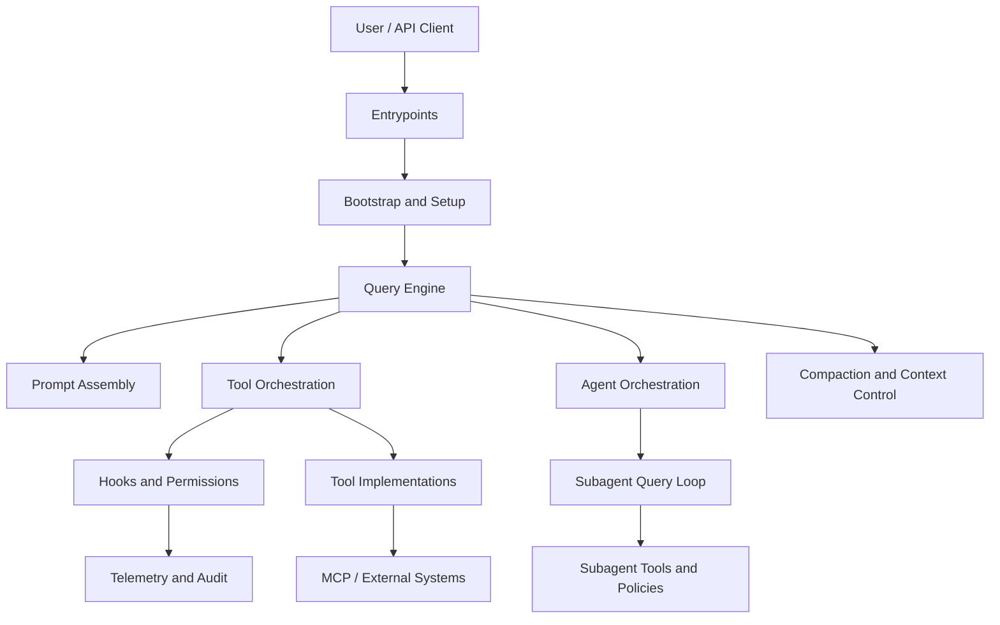

# Claude Code Architecture Reference (Spring-Style)

This documentation set is organized like a Spring reference guide: each chapter isolates one topic, starts from a conceptual overview, then drills into implementation details and concrete source mappings.

## Documentation Goals

- Explain architecture from high level to low level.
- Connect core design principles to concrete runtime behavior.
- Map concepts to source files for fast verification.
- Provide Mermaid diagrams across different modeling styles.

## How to Read This Guide

1. Read Chapters 1-3 for platform model and prompt architecture.
2. Read Chapters 4-6 for runtime loop, tools, and agent orchestration.
3. Read Chapters 7-10 for extension ecosystem, governance, and operations.
4. Use the appendix as a quick source map for deeper code study.

## Chapters

1. [Chapter 01 - System Overview and Architectural Principles](./chapter-01-system-overview.md)
2. [Chapter 02 - Startup, Bootstrap, and Session Initialization](./chapter-02-startup-bootstrap.md)
3. [Chapter 03 - Prompt Assembly and Context Architecture](./chapter-03-prompt-architecture.md)
4. [Chapter 04 - Query Engine and Turn Execution Loop](./chapter-04-query-engine-and-turn-loop.md)
5. [Chapter 05 - Tool Governance and Execution Pipeline](./chapter-05-tool-governance-and-execution.md)
6. [Chapter 06 - Agent Orchestration and Subagent Runtime](./chapter-06-agent-orchestration.md)
7. [Chapter 07 - Skills, Plugins, Hooks, and MCP Integration](./chapter-07-skills-plugins-hooks-mcp.md)
8. [Chapter 08 - State Model, Context, and Memory Surfaces](./chapter-08-state-context-and-memory.md)
9. [Chapter 09 - Permission, Security, and Runtime Safety](./chapter-09-permission-security-and-safety.md)
10. [Chapter 10 - Operating Modes, Observability, and Performance](./chapter-10-operating-modes-observability-and-performance.md)
11. [Appendix - Source File Index](./appendix-source-map.md)

## Reference Diagram: Full Runtime Layers

## Diagram Catalog

The guide intentionally uses multiple Mermaid graph styles:

- `flowchart`
- `sequenceDiagram`
- `stateDiagram-v2`
- `classDiagram`
- `erDiagram`
- `journey`
- `gantt`
- `pie`
- `mindmap`
- `gitGraph`
