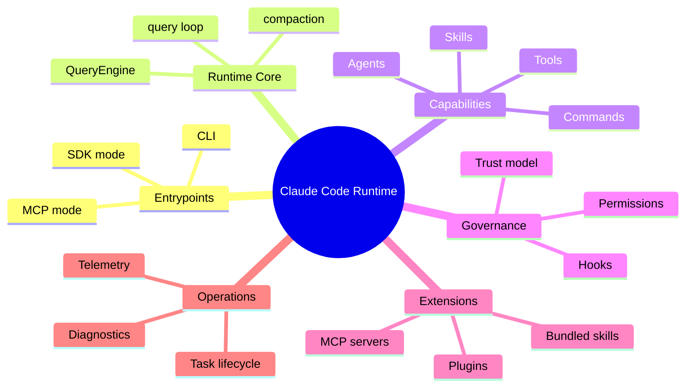
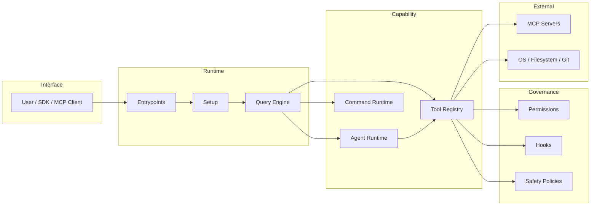

# Chapter 01 - System Overview and Architectural Principles

## 1. Overview

Claude Code is architected as an agent runtime platform, not a plain command-line chat client. The system combines prompt orchestration, tool governance, permission control, subagent execution, plugin/skill extension, and MCP integration under one runtime model.

This chapter establishes the global architecture and design principles that every later chapter builds on.

## 2. High-Level Architecture

At the highest level, the platform is split into:

- **Entry and bootstrap layer**: process startup, mode selection, security preconditions.
- **Conversation runtime layer**: turn execution, message state, compaction, model interaction.
- **Capability layer**: tools, skills, commands, plugin-provided operations, MCP tools.
- **Governance layer**: permission checks, hooks, safety constraints, trust boundaries.
- **Control-plane layer**: telemetry, diagnostics, task lifecycle, background worker management.

## 3. Core Design Principles

### 3.1 Controlled Capability Over Raw Power

All capabilities are exposed through governed interfaces. Even built-in tools execute through validation, hooks, permissions, and tracing.

### 3.2 Dynamic Composition Over Static Prompting

System behavior is assembled at runtime from feature gates, session state, connected MCP servers, output style, and user context.

### 3.3 Specialized Agents Over Single-Agent Monoliths

Different agent types are designed for different cognitive roles (explore, plan, verification, general-purpose), reducing role conflicts and improving reliability.

### 3.4 Extensible by Construction

Skills, plugins, hooks, and MCP are first-class extension mechanisms rather than afterthoughts.

### 3.5 Cost-Aware Context Management

Prompt cache boundaries, selective dynamic sections, and context compaction are architectural features, not optimization patches.

## 4. Low-Level Component Topology

### 4.1 Main Module Clusters

- `src/entrypoints/*`: CLI, MCP, SDK modes.
- `src/main.tsx`: top-level interactive orchestration.
- `src/setup.ts`: pre-turn and environment setup.
- `src/query.ts`, `src/QueryEngine.ts`: conversation core.
- `src/tools.ts`, `src/Tool.ts`: tool registry and interfaces.
- `src/services/tools/*`: tool orchestration and execution pipeline.
- `src/tools/AgentTool/*`: subagent runtime and scheduling.
- `src/constants/prompts.ts`: system prompt assembly.
- `src/utils/hooks.ts`: hook runtime engine.
- `src/services/mcp/client.ts`: MCP server and tool integration.
- `src/bootstrap/state.ts`: global runtime state.

### 4.2 Architectural Layering Rules (Practical)

- Entrypoints bootstrap runtime and dispatch to one operating mode.
- Query runtime is the center of turn lifecycle.
- Tool and agent systems plug into query runtime rather than owning it.
- Governance (hooks/permissions) surrounds execution paths.
- Extensions can add behavior, but still pass through governance boundaries.

## 5. Design Graphs

### 5.1 Architecture Mindmap

### 5.2 Layered Flow

## 6. Implementation Notes

- Treat `query` runtime as the central execution engine; most major subsystems are adapters around it.
- Track safety and policy paths as first-order architecture, not just business logic.
- When introducing new capabilities, design both execution logic and governance hooks together.

## 7. Next Chapter

Continue with [Chapter 02 - Startup, Bootstrap, and Session Initialization](./chapter-02-startup-bootstrap.md).
