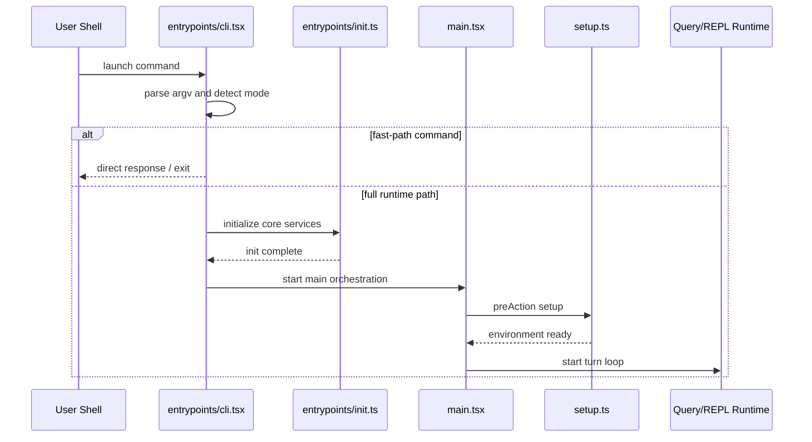

# Chapter 02 - Startup, Bootstrap, and Session Initialization

## 1. Overview

Startup is intentionally split into lightweight entrypoint routing and deeper initialization. This keeps fast-path commands responsive while preserving strong runtime safety for interactive or long-running sessions.

## 2. High-Level Startup Model

### 2.1 Fast Path vs Full Path

- **Fast path**: direct handling for lightweight commands such as version/help-like behavior and process-level utilities.
- **Full path**: routes through initialization and setup for interactive, tool-using, or sessionful modes.

### 2.2 Startup Responsibilities by Layer

- `entrypoints/cli.tsx`: initial dispatch and mode routing.
- `entrypoints/init.ts`: global one-time initialization and services.
- `main.tsx`: argument parsing, mode orchestration, app lifecycle.
- `setup.ts`: environment validation, trust/permission preconditions, runtime service setup.

## 3. Core Design Decisions

### 3.1 Memoized Initialization

Initialization logic is memoized/guarded to avoid duplicate side effects in repeated paths.

### 3.2 Early Security Preconditions

Unsafe permission modes are checked before entering full runtime behaviors.

### 3.3 Environment-Sensitive Bootstrapping

Startup paths branch by execution context (interactive CLI, non-interactive mode, daemon, remote control, MCP server mode).

## 4. Low-Level Flow Details

### 4.1 Entry and Dispatch

`entrypoints/cli.tsx` performs:

1. Early arg checks for low-latency command execution.
2. Dispatch to specialized entrypoints for daemon/remote/MCP related modes.
3. Transfer to `main.tsx` for normal interactive behavior.

### 4.2 Core Initialization

`entrypoints/init.ts` performs:

- runtime config activation
- shutdown handlers
- analytics and telemetry bootstrap
- selected background service initialization
- policy and managed-settings groundwork

### 4.3 Session Setup

`setup.ts` performs:

- Node/runtime version checks
- CWD resolution and mutation
- hook configuration snapshot capture
- watcher/service startup
- permission mode validation (including dangerous modes)
- optional worktree/session workflow preparation

## 5. Diagrams

### 5.1 Startup Sequence

### 5.2 Bootstrap Timeline (Phase View)

```mermaid
gantt
    title Session Bootstrap Timeline
    dateFormat  X
    axisFormat %L

    section Entry
    argv parse and mode route      :a1, 0, 8
    fast-path handling             :a2, 2, 4

    section Initialization
    init core services             :b1, 8, 14
    telemetry and diagnostics      :b2, 10, 10

    section Setup
    cwd and environment checks     :c1, 22, 10
    hooks snapshot                 :c2, 24, 8
    permission safety checks       :c3, 26, 8

    section Runtime
    interactive loop starts        :d1, 34, 8
```

## 6. Source File Mapping

- `src/entrypoints/cli.tsx`
- `src/entrypoints/init.ts`
- `src/main.tsx`
- `src/setup.ts`

## 7. Implementation Guidance

- Add new startup modes in entrypoint routing, but keep full runtime initialization centralized.
- Put policy and trust checks before heavy task startup.
- Keep startup order deterministic because hook snapshots, permission context, and telemetry depend on it.

## 8. Next Chapter

Continue with [Chapter 03 - Prompt Assembly and Context Architecture](./chapter-03-prompt-architecture.md).
