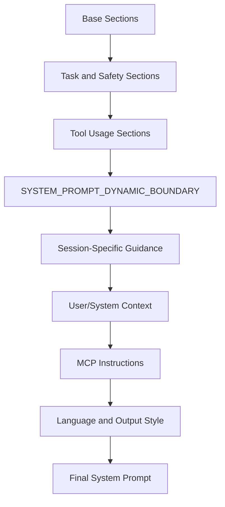
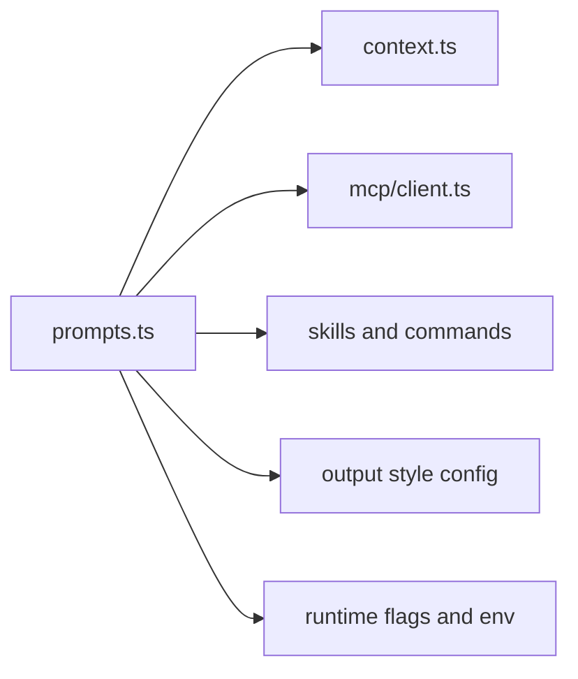

# Chapter 03 - Prompt Assembly and Context Architecture

## 1. Overview

Prompting in this codebase is an assembly pipeline, not a static text asset. The system prompt is composed from reusable sections, gated capabilities, environment-derived context, and session-specific details.

## 2. High-Level Prompt Model

### 2.1 Prompt as Structured Runtime Artifact

The runtime treats prompt content as layered modules:

- static instruction sections
- dynamic session overlays
- environment and user context blocks
- extension-contributed instructions (for example MCP instructions)

### 2.2 Cache-Aware Prompt Partitioning

`SYSTEM_PROMPT_DYNAMIC_BOUNDARY` explicitly marks where cross-session cacheable sections end and session-specific sections begin.

## 3. Core Design Decisions

### 3.1 Section-Based Composition

Prompt content is generated by dedicated functions rather than freeform concatenation. This supports maintainability and targeted tuning.

### 3.2 Dynamic, Feature-Gated Guidance

Capability-specific guidance appears only when relevant tools/features are active.

### 3.3 Context-Driven Behavior Injection

Runtime context from system, user, session, and connected extensions is injected at assembly time.

## 4. Low-Level Composition Details

### 4.1 Central Prompt Builder

`src/constants/prompts.ts` orchestrates:

- intro/system/task behavior instructions
- tone and output style
- action/safety guidance
- tool usage grammar
- session-specific guidance
- language overrides
- memory/scratchpad integration
- MCP instruction injection

### 4.2 Context Providers

`src/context.ts` provides memoized context fragments:

- system context (environment/session technical context)
- user context (project/user-facing context like date and user docs)

### 4.3 Agent Prompt Layering

Agent-specific prompts are composed on top of baseline runtime rules to enforce role specialization.

## 5. Diagrams

### 5.1 Prompt Assembly Pipeline

### 5.2 Prompt Section Dependency Graph

## 6. Source File Mapping

- `src/constants/prompts.ts`
- `src/context.ts`
- `src/tools/AgentTool/prompt.ts`

## 7. Implementation Guidance

- Keep new prompt sections modular and independently testable.
- Place cross-session stable instructions before the dynamic boundary.
- Avoid adding session-specific instructions to static sections; this degrades cache reuse and raises token costs.

## 8. Next Chapter

Continue with [Chapter 04 - Query Engine and Turn Execution Loop](./chapter-04-query-engine-and-turn-loop.md).
