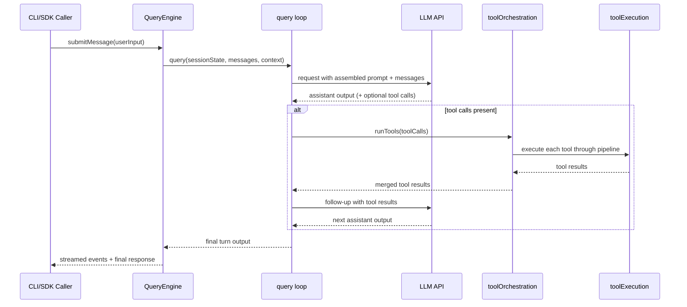
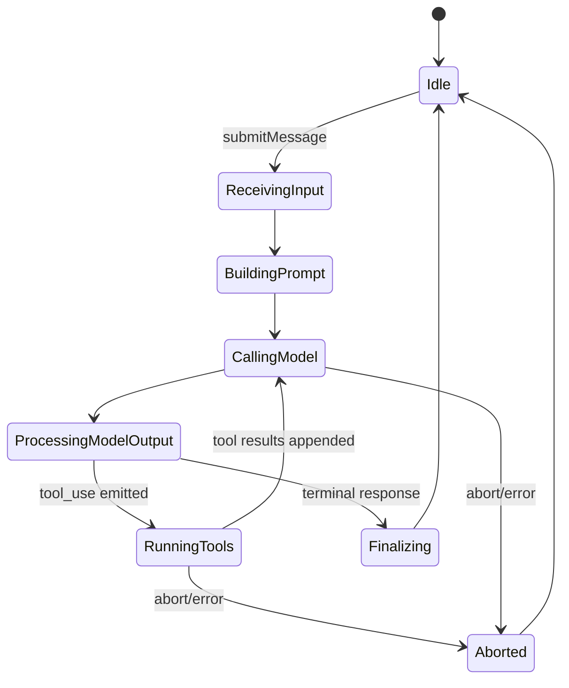

# Chapter 04 - Query Engine and Turn Execution Loop

## 1. Overview

The query loop is the execution heart of the platform. It coordinates model turns, tool calls, retries, state mutation, and completion signaling.

## 2. High-Level Runtime Contract

### 2.1 `QueryEngine` as Session Facade

`QueryEngine` encapsulates mutable per-session resources:

- message history
- read-file state caches
- permission denial history
- usage accounting
- abort control

### 2.2 `query` as Turn Loop Executor

`query(...)` and its internal loop manage one assistant turn end-to-end, including iterative tool-call rounds until terminal response.

## 3. Core Design Decisions

### 3.1 Generator-Based Streaming

The loop is modeled as async generators to emit intermediate events and incremental updates.

### 3.2 Long-Session Stability

Compaction and token budgeting are integrated into the loop to support effectively unbounded conversational workflows.

### 3.3 Runtime-Managed Abortability

Abort controllers are threaded through context to make long operations interruptible.

## 4. Low-Level Execution Anatomy

### 4.1 Message Submission Path

Typical path:

1. Caller invokes `QueryEngine.submitMessage(...)`.
2. Engine updates session state and metadata.
3. Engine invokes `query(...)`.
4. Loop drives model requests and processes model outputs.
5. Tool calls are delegated to tool orchestration.
6. Results are appended and loop continues.
7. Final assistant response is emitted.

### 4.2 Turn Loop Interactions

- prompt assembly
- model invocation
- tool call extraction
- tool orchestration
- hook and permission interactions
- usage/telemetry reporting

## 5. Diagrams

### 5.1 Turn Execution Sequence

### 5.2 Turn Lifecycle State Machine

## 6. Source File Mapping

- `src/QueryEngine.ts`
- `src/query.ts`
- `src/queryLoop.ts`

## 7. Implementation Guidance

- Keep per-turn side effects in explicit lifecycle phases.
- Preserve deterministic ordering when appending model/tool messages.
- Add new turn-level policies in the loop, not ad-hoc in tool implementations.

## 8. Next Chapter

Continue with [Chapter 05 - Tool Governance and Execution Pipeline](./chapter-05-tool-governance-and-execution.md).
