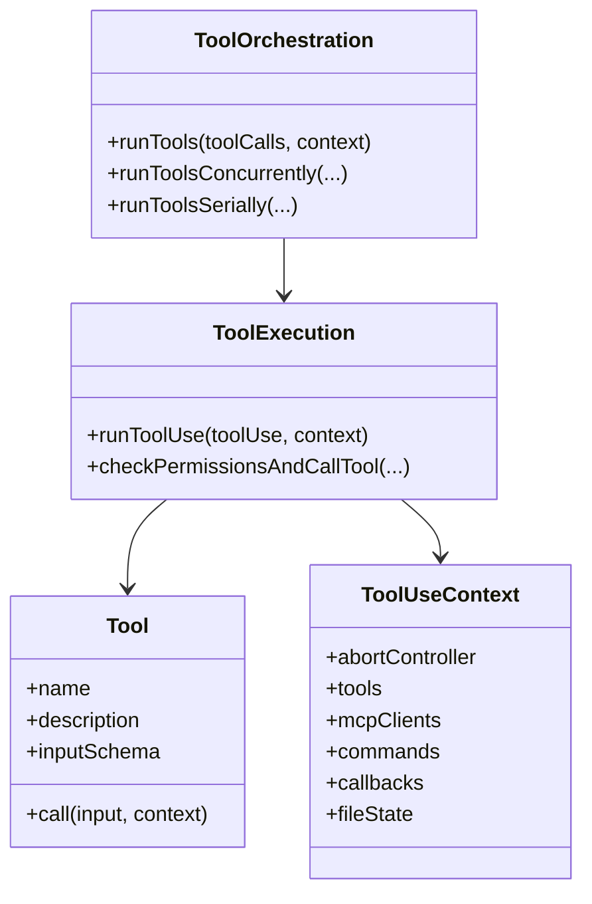

# Chapter 05 - Tool Governance and Execution Pipeline

## 1. Overview

Tool invocation is governed, not direct. The runtime enforces a strict pipeline around each call to guarantee safety, consistency, and auditability.

## 2. High-Level Tool Model

### 2.1 Tool Registry and Resolution

Tools are collected from:

- built-in tool definitions
- MCP-provided tools
- context-filtered availability rules

Resolution is done through registry logic before execution starts.

### 2.2 Orchestration vs Execution

- **Orchestration** (`runTools`) decides grouping and parallel/serial scheduling.
- **Execution** (`runToolUse`) handles one tool call end-to-end with policy gates.

## 3. Core Design Decisions

### 3.1 Multi-Stage Validation

Input schema parse and tool-specific validation happen before execution.

### 3.2 Hook-Integrated Control Plane

Hooks can inspect, enrich, or block execution and can influence permission handling.

### 3.3 Unified Permission Gate

Permission checks are centralized and invoked uniformly even when hooks are active.

### 3.4 First-Class Failure Handling

Failure hooks and structured errors are built into the same pipeline.

## 4. Low-Level Pipeline Steps

For a typical tool call:

1. Resolve tool and parse call payload.
2. Validate input with schema and tool validator.
3. Execute pre-tool hooks.
4. Resolve hook-driven permission behavior.
5. Run permission decision flow.
6. Execute tool implementation.
7. Emit telemetry and usage.
8. Execute post-tool hooks (or failure hooks).
9. Return structured tool result to query loop.

## 5. Diagrams

### 5.1 Tool Call Governance Pipeline

```mermaid
flowchart TD
    A[Tool Call Request] --> B[Resolve Tool]
    B --> C[Schema Validation]
    C --> D[Tool-specific validateInput]
    D --> E[PreToolUse Hooks]
    E --> F[Permission Resolution]
    F --> G{Allowed?}
    G -- No --> H[Denied Result + Telemetry]
    G -- Yes --> I[Execute tool.call()]
    I --> J{Success?}
    J -- Yes --> K[PostToolUse Hooks]
    J -- No --> L[PostToolUseFailure Hooks]
    K --> M[Structured Tool Result]
    L --> M
    H --> M
```

### 5.2 Core Type Relationships



## 6. Source File Mapping

- `src/Tool.ts`
- `src/tools.ts`
- `src/services/tools/toolOrchestration.ts`
- `src/services/tools/toolExecution.ts`

## 7. Implementation Guidance

- Do not bypass orchestration/execution pipeline when adding tools.
- Keep permissions and hooks composable; avoid hardcoding tool-local bypass logic.
- Use structured error objects so query runtime can reason over failures uniformly.

## 8. Next Chapter

Continue with [Chapter 06 - Agent Orchestration and Subagent Runtime](./chapter-06-agent-orchestration.md).
