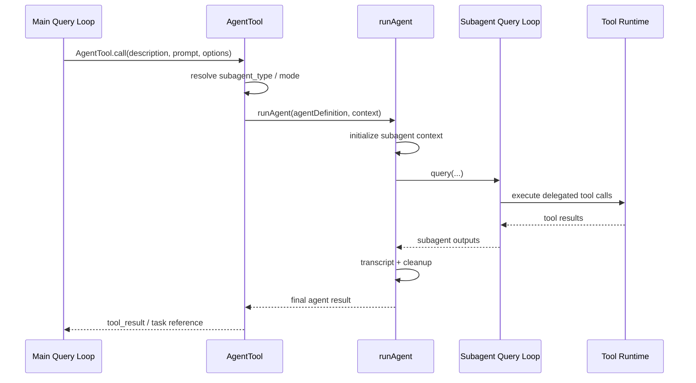
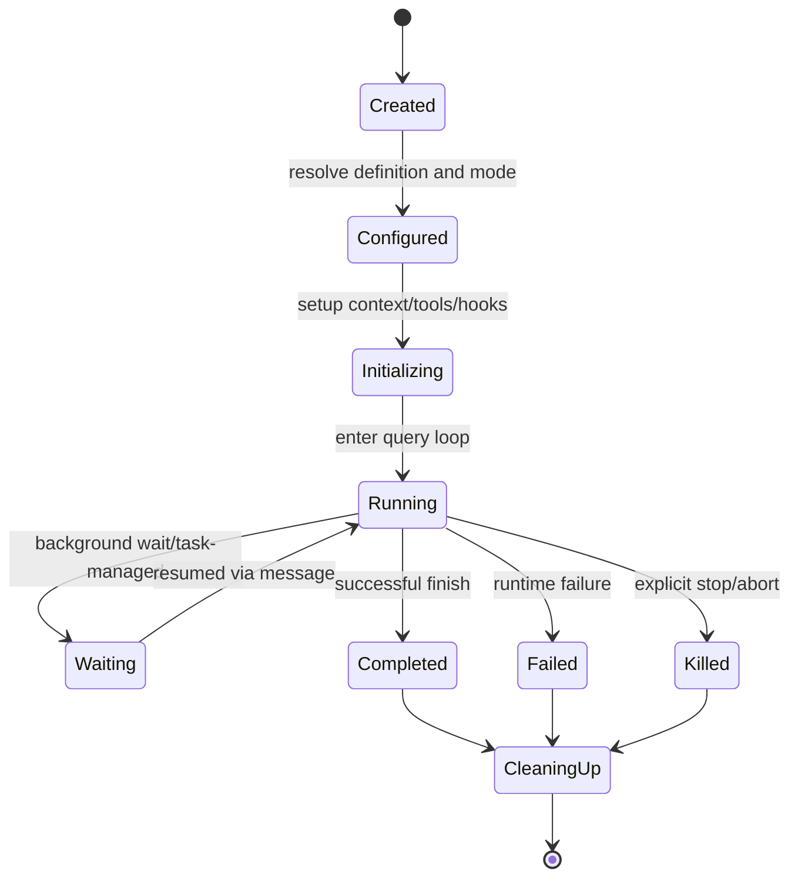

# Chapter 06 - Agent Orchestration and Subagent Runtime

## 1. Overview

The agent subsystem enables controlled delegation. It supports specialized built-in agents, custom agent definitions, forked subagents, background execution, and optional isolation modes.

## 2. High-Level Agent Model

### 2.1 Roles

- **Primary runtime agent**: user-facing coordinator for current session.
- **Subagents**: delegated workers for focused tasks.
- **Specialized agents**: explore, plan, verification, and other role-scoped variants.

### 2.2 Delegation Outcomes

Delegation can run:

- foreground (synchronous relative to the caller turn)
- background (task-managed async)
- isolated contexts (for example worktree or remote-capable modes where enabled)

## 3. Core Design Decisions

### 3.1 Delegation as Tool Operation

Subagent spawning is exposed through `AgentTool`, so delegation still follows the governed tool architecture.

### 3.2 Explicit Agent Definitions

Built-in and custom agent definitions carry role prompts, enabled constraints, and optional runtime augmentations.

### 3.3 Lifecycle Completeness

Subagent setup and teardown include context assembly, transcript recording, metadata, and cleanup.

## 4. Low-Level Runtime Anatomy

### 4.1 `AgentTool` Responsibilities

- parse and validate agent invocation input
- resolve agent type and mode (fork/normal/background/isolation)
- construct subagent prompt/messages
- assemble tools and runtime context
- invoke subagent runner
- return direct result or task notification linkage

### 4.2 `runAgent` Responsibilities

- initialize agent-scoped extensions
- create subagent context and permissions
- invoke query loop for delegated turn(s)
- emit sidechain transcript and metadata
- clean up MCP, hooks, and task resources

## 5. Diagrams

### 5.1 Delegation Sequence

### 5.2 Subagent Lifecycle State Machine

## 6. Source File Mapping

- `src/tools/AgentTool/AgentTool.tsx`
- `src/tools/AgentTool/runAgent.ts`
- `src/tools/AgentTool/builtInAgents.ts`

## 7. Implementation Guidance

- Keep delegation prompts explicit; do not outsource problem understanding to subagents.
- Prefer specialization where role boundaries reduce context and improve reliability.
- Ensure every new agent mode defines teardown semantics, not only startup semantics.

## 8. Next Chapter

Continue with [Chapter 07 - Skills, Plugins, Hooks, and MCP Integration](./chapter-07-skills-plugins-hooks-mcp.md).
