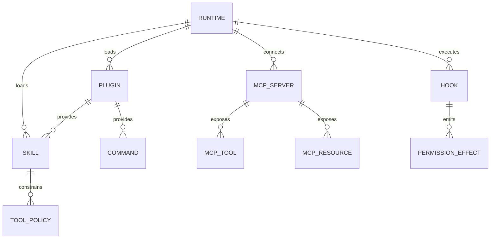
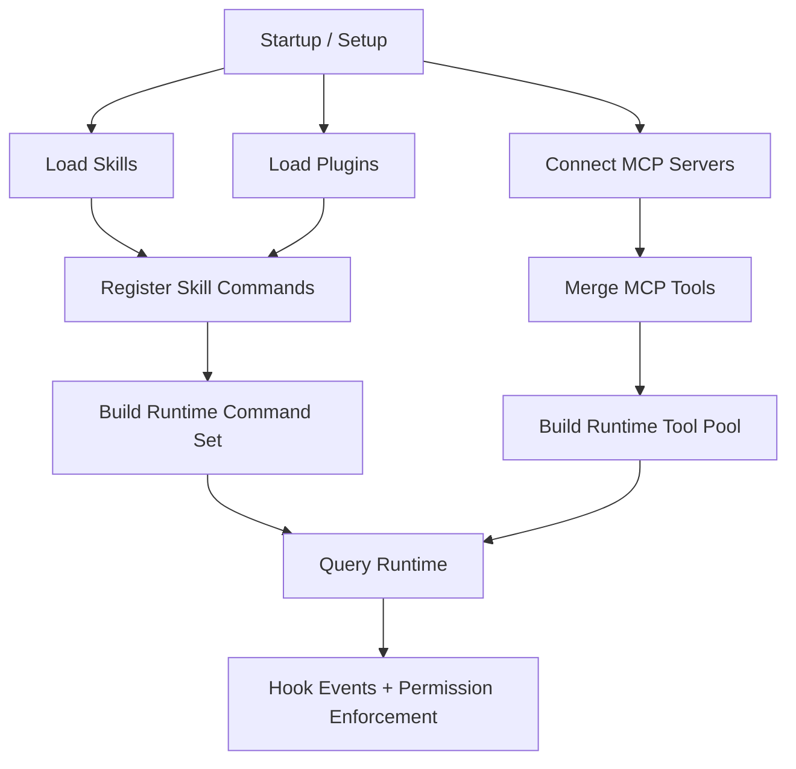
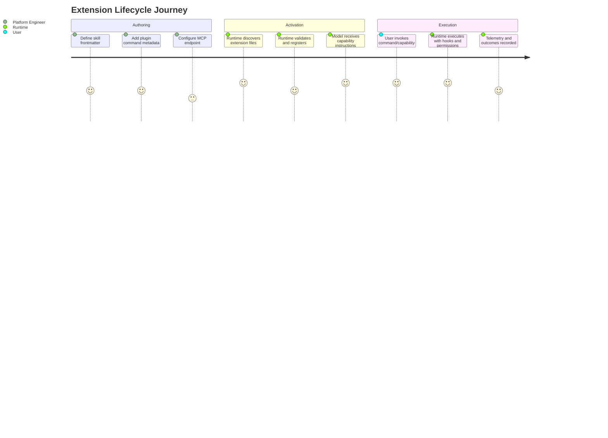

# Chapter 07 - Skills, Plugins, Hooks, and MCP Integration

## 1. Overview

The extension architecture is multi-plane:

- **Skills** package reusable workflow prompts.
- **Plugins** add commands/skills with metadata and constraints.
- **Hooks** inject policy/runtime behavior around lifecycle events.
- **MCP** contributes external tools, resources, and instructions.

These mechanisms are integrated with runtime governance rather than bypassing it.

## 2. High-Level Extension Model

### 2.1 Skills

Skills are prompt-native capability bundles loaded from known directories and merged into command/runtime availability.

### 2.2 Plugins

Plugins are structured packages that provide commands, skills, metadata, configuration interpolation, and optional constraints.

### 2.3 Hooks

Hooks are event-driven callbacks/commands that run before/after operations and can influence continuation and permission behavior.

### 2.4 MCP

MCP acts as both capability bridge (tools/resources) and instruction surface (usage guidance injected into prompt context).

## 3. Core Design Decisions

### 3.1 Extension Within Governance

All extension paths still funnel into permission checks and hook-aware execution.

### 3.2 Prompt-Visible Capabilities

Extensions are not hidden runtime additions; the model receives corresponding instruction/context for correct usage.

### 3.3 Lazy and Conditional Loading

Feature flags, directory scanning, and availability checks reduce startup overhead and avoid irrelevant capability exposure.

## 4. Low-Level Mechanics

### 4.1 Skills Loading

- discover skill files
- parse frontmatter fields
- apply ignore and path normalization rules
- build command/tool-facing metadata

### 4.2 Plugin Loading

- discover plugin markdown command files and skill files
- parse metadata and options
- perform variable substitution for runtime-specific values
- register as invocable commands/capabilities

### 4.3 Hook Runtime

- evaluate hook matchers against event/tool context
- execute hook commands/callbacks
- parse structured hook outputs
- apply control effects (messages, input updates, continuation control, permission directives)

### 4.4 MCP Client Runtime

- connect via configured transport(s)
- retrieve tools/commands/resources
- normalize and merge into runtime tool pool
- inject server-provided instructions when appropriate

## 5. Diagrams

### 5.1 Extension Relationship Model

### 5.2 Extension Loading and Usage Flow

### 5.3 Extension Operator Journey

## 6. Source File Mapping

- `src/skills/loadSkillsDir.ts`
- `src/utils/plugins/loadPluginCommands.ts`
- `src/utils/hooks.ts`
- `src/services/mcp/client.ts`
- `src/commands.ts`

## 7. Implementation Guidance

- Design extensions so behavior is explicit to both runtime and model instructions.
- Keep extension outputs structured; avoid hidden side effects.
- If an extension introduces execution capability, also define governance expectations (permissions, hooks, observability).

## 8. Next Chapter

Continue with [Chapter 08 - State Model, Context, and Memory Surfaces](./chapter-08-state-context-and-memory.md).
