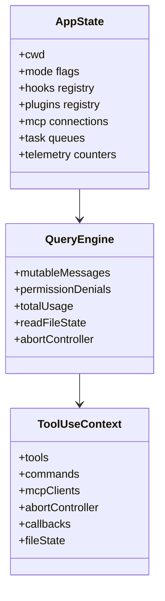
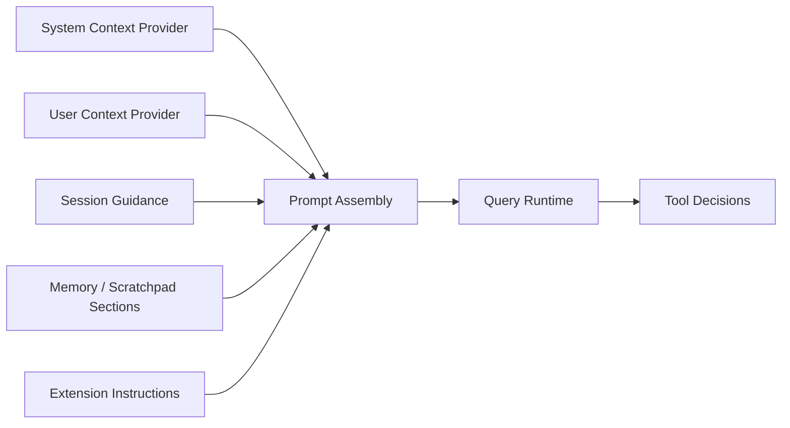

# Chapter 08 - State Model, Context, and Memory Surfaces

## 1. Overview

Runtime quality depends on data shape discipline. This chapter covers global state, per-turn mutable context, and context providers that feed both execution and prompt assembly.

## 2. High-Level State Model

### 2.1 State Scopes

- **Process/session-global state**: app mode, runtime services, telemetry handles.
- **Conversation state**: messages, usage, denials, read file caches.
- **Turn-local state**: tool invocation context and transient decisions.
- **Extension state**: plugin/hook registrations and MCP client snapshots.

### 2.2 Context Surfaces

- system context
- user context
- session guidance
- memory/scratchpad-like guidance sections

## 3. Core Design Decisions

### 3.1 Centralized Global State

`AppState` centralizes mutable runtime facts so mode transitions and services share one source of truth.

### 3.2 Typed Tool Context

`ToolUseContext` carries all execution dependencies explicitly, avoiding hidden globals in tool implementations.

### 3.3 Context Injection Over Hardcoding

Runtime context is assembled and injected per turn, instead of static prompt assumptions.

## 4. Low-Level Structures

### 4.1 `AppState`

Defined in bootstrap/state modules, including:

- session and cwd context
- interaction mode flags
- registered hooks/plugins
- mcp client data
- task and agent tracking fields
- usage and telemetry counters

### 4.2 `QueryEngine` Session Fields

Includes:

- mutable message chain
- permission denials
- total usage
- read-file state cache
- abort controller

### 4.3 `ToolUseContext`

Provides:

- available tools and commands
- mcp clients
- abort signal/control
- read/write callback hooks
- file state references

## 5. Diagrams

### 5.1 Runtime State Class View

### 5.2 Context-to-Prompt Data Flow

## 6. Source File Mapping

- `src/bootstrap/state.ts`
- `src/Tool.ts`
- `src/QueryEngine.ts`
- `src/context.ts`
- `src/constants/prompts.ts`

## 7. Implementation Guidance

- Introduce new state fields with clear scope boundaries (global/session/turn).
- Thread state through typed contexts where possible.
- Keep prompt-facing context derivations deterministic and side-effect free.

## 8. Next Chapter

Continue with [Chapter 09 - Permission, Security, and Runtime Safety](./chapter-09-permission-security-and-safety.md).
