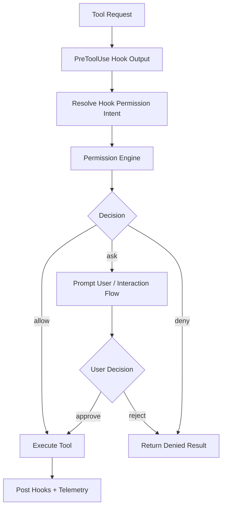
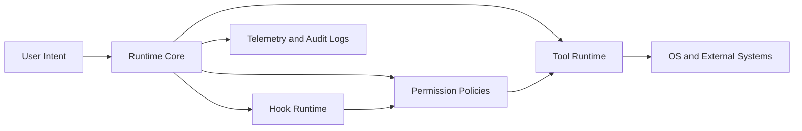

# Chapter 09 - Permission, Security, and Runtime Safety

## 1. Overview

Safety is implemented as runtime policy, not post-hoc validation. Permission decisions, hook-mediated controls, and trust-aware behavior are integrated into normal execution paths.

## 2. High-Level Safety Architecture

### 2.1 Security Control Points

- workspace trust preconditions
- tool permission policy checks
- hook decision overlays
- runtime mode constraints
- user-interaction gates for sensitive actions

### 2.2 Safety Principle

The system optimizes for controlled action: tools should be useful, but every non-trivial side effect is policy-aware.

## 3. Core Design Decisions

### 3.1 Permission as Mandatory Gate

Tool use requests are routed through permission flow instead of relying on tool-local decisions.

### 3.2 Hook Power with Guardrails

Hooks can influence behavior, but cannot become an unrestricted bypass channel.

### 3.3 Trust-Aware Hook Execution

In interactive contexts, untrusted workspaces can prevent hook execution as defense-in-depth.

## 4. Low-Level Safety Mechanics

### 4.1 Permission Engine

`useCanUseTool.tsx` and related permission logic support:

- allow/ask/deny decision modes
- interactive and non-interactive handling
- specialized handling for coordinator/worker flows
- telemetry logging of policy outcomes

### 4.2 Hook Safety Path

`utils/hooks.ts` includes:

- trust checks before hook execution
- bounded timeout behavior for lifecycle hooks
- async hook tracking and completion handling
- structured parsing of hook outputs

### 4.3 Policy-Integrated Tool Execution

`toolExecution.ts` merges:

- hook-derived permission directives
- policy rules
- user confirmation channels
- continuation controls

## 5. Diagrams

### 5.1 Permission Decision Flow

### 5.2 Security Boundary Topology

## 6. Source File Mapping

- `src/hooks/useCanUseTool.tsx`
- `src/utils/hooks.ts`
- `src/services/tools/toolExecution.ts`
- `src/setup.ts`

## 7. Implementation Guidance

- Model security rules as part of execution design, not optional middleware.
- Keep deny semantics explicit and observable to users.
- Whenever adding capability, document expected permission behavior and trust requirements.

## 8. Next Chapter

Continue with [Chapter 10 - Operating Modes, Observability, and Performance](./chapter-10-operating-modes-observability-and-performance.md).
