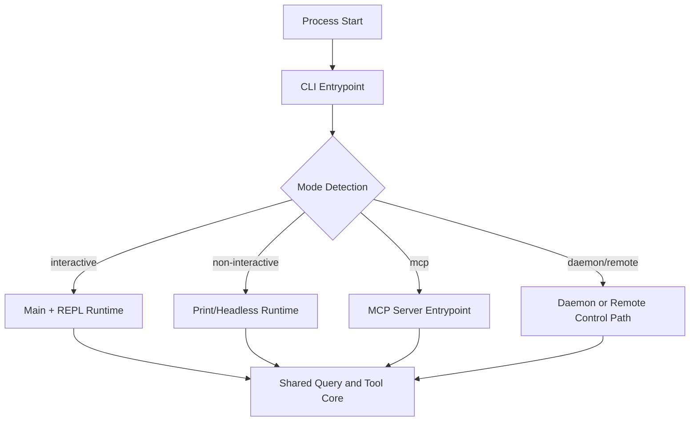
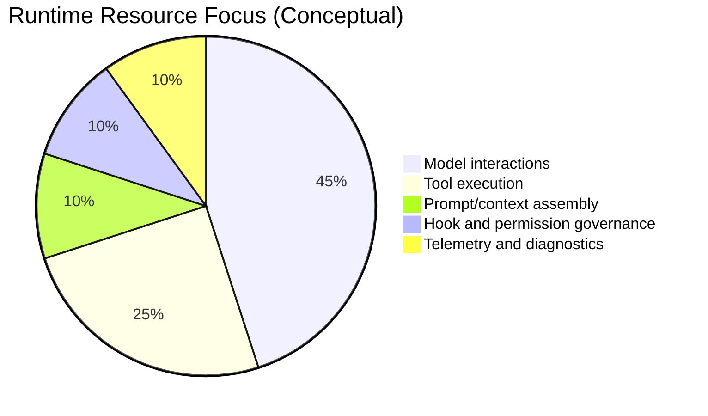
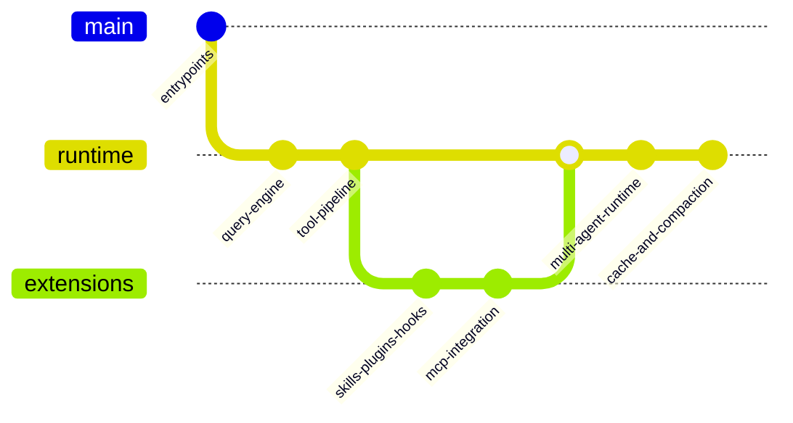

# Chapter 10 - Operating Modes, Observability, and Performance

## 1. Overview

This chapter explains how the same runtime supports multiple operating surfaces, and how observability and performance are treated as architectural concerns.

## 2. High-Level Operating Modes

### 2.1 Runtime Surfaces

- interactive CLI mode
- non-interactive print/headless mode
- MCP server mode
- daemon and remote-control oriented paths
- coordinator-style multi-worker mode (feature-gated)

### 2.2 Shared Runtime Principle

Different surfaces reuse the same core query/tool/agent machinery where possible, minimizing logic divergence.

## 3. Core Design Decisions

### 3.1 Mode-Specific Entrypoints, Shared Internals

Entrypoints route by mode; runtime internals stay mostly shared.

### 3.2 Built-In Observability

Telemetry and diagnostics are integrated into initialization and tool/query execution rather than bolted on afterward.

### 3.3 Performance by Design

Prompt caching boundaries, memoization, lazy loading, and safe parallel tool scheduling are built into architecture.

## 4. Low-Level Details

### 4.1 Mode Routing

- `entrypoints/cli.tsx` performs early mode selection.
- `entrypoints/mcp.ts` hosts MCP protocol server behavior.
- `main.tsx` and setup paths orchestrate interactive/headless details.

### 4.2 Observability Sources

- analytics events during startup and execution
- hook and tool timing contributions
- diagnostics logging for runtime behavior
- agent lifecycle metadata and transcripts

### 4.3 Performance Levers

- prompt dynamic boundary and cache scope strategy
- memoized loaders (commands, skills, plugins, context fragments)
- concurrent-safe tool execution partitioning
- context compaction and token budget controls

## 5. Diagrams

### 5.1 Operating Mode Dispatch

### 5.2 Runtime Cost Allocation (Conceptual)

### 5.3 Architecture Evolution Trace

## 6. Source File Mapping

- `src/entrypoints/cli.tsx`
- `src/entrypoints/mcp.ts`
- `src/main.tsx`
- `src/services/analytics/index.ts`
- `src/constants/prompts.ts`
- `src/services/tools/toolOrchestration.ts`

## 7. Implementation Guidance

- When adding a new operating mode, reuse shared runtime contracts and avoid duplicating core logic.
- Add observability hooks at architectural boundaries (entrypoint, turn loop, tool execution, agent lifecycle).
- Treat performance regressions as architecture defects, not only implementation defects.

## 8. End of Core Chapters

Continue with [Appendix - Source File Index](./appendix-source-map.md).
